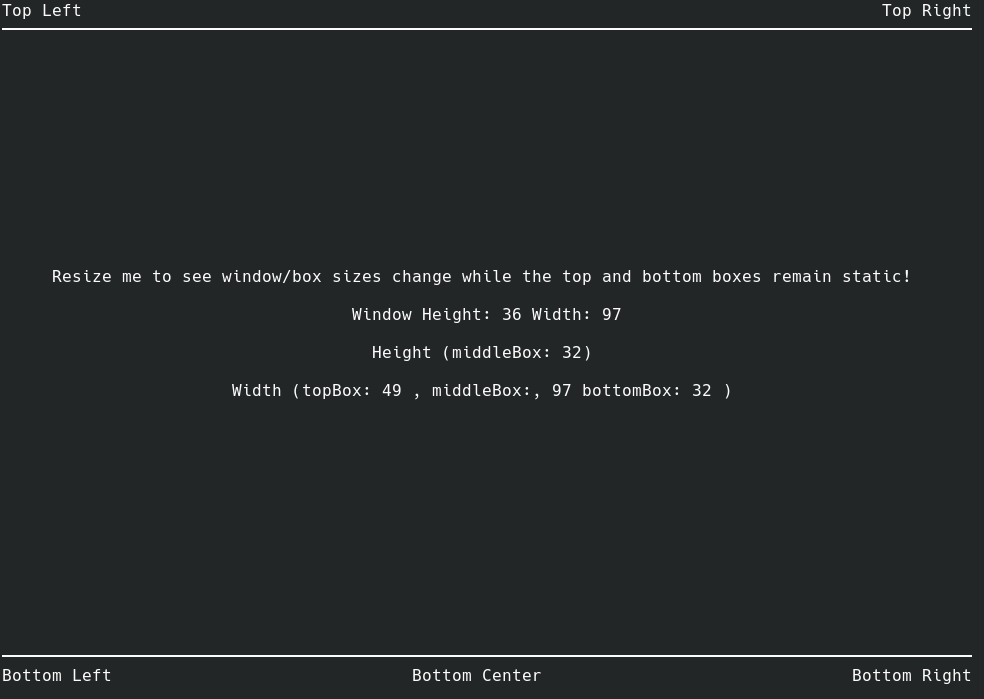

A simple layout example with a vertically fixed size top and bottom bar where the middle "content" section height is dynamic. 

A bubbletea spinner is included to demonstrate how to use one with bubbletea.

<!-- blank line -->
<figure class="video_container">
  <video controls="true" allowfullscreen="true">
    <source src="./three-row-spinner.mp4" type="video/mp4">
  </video>
</figure>
<!-- blank line -->
